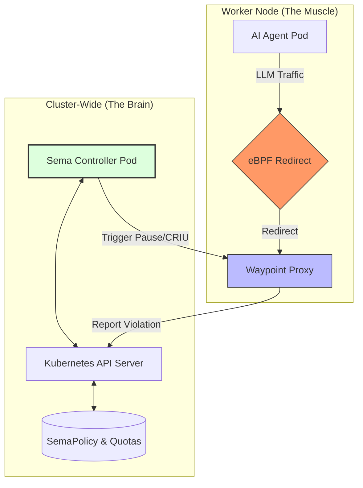

# 🕸️ SemaMesh: The Semantic AI Service Mesh
**SemaMesh** is a next-generation, sidecarless service mesh built specifically for the governance, security, and financial oversight of Autonomous AI Agents in Kubernetes.

By moving beyond simple Layer 4/7 networking into **Layer 8+ Semantic Networking**, SemaMesh understands not just where a packet is going, but the **intent** of the AI agent sending it.

## TL;DR: 
Testing the SemaMesh is as easy as running the provided smoke-test script in a local Kind cluster (OrbStack is preferred). This will verify end-to-end functionality, including policy enforcement.

[**Quick Start (Recommended)**](#2-quick-start-recommended)


## 📖 Table of Contents
✨ [**Key Features**](#-key-features)

🏗 [**Architecture**](#-architecture)

🚀 [**Getting Started**](#-getting-started)

🛡️ [**Security Warning**](#-security-warning)

📜 [**Example Policy**](#-example-policy)

🛠️ [**Technical Deep Dive**](#-technical-deep-dive)

🤝 [**Contributing**](#-contributing)

## ✨ Key Features
- **Sidecarless eBPF Interception**: Transparently hijacks AI traffic at the kernel level. No sidecars, no manual pod injection, and near-zero latency overhead.
- **Stateful Pause (The Kill-Switch)**: Uses CRIU to freeze high-risk agents mid-thought. If an agent tries to delete a namespace or bypass safety protocols, its RAM is snapshotted to disk for human review.
- **Semantic Quota Management**: Define token budgets via CRDs. Prevent recursive agent loops from draining your OpenAI/Anthropic wallet.
- **Modular Middleware**: A Go-based Waypoint Proxy that allows you to "snap in" new features like PII redaction or LLM response caching.

## 🏗️ Architecture
SemaMesh operates as a Node-level AI Gateway. Unlike traditional sidecar-based service meshes, SemaMesh uses eBPF to transparently intercept AI traffic without modifying your application pods.


### Architecture Diagram


### Key Architectural Layers
1. **The Trap (eBPF Layer)**
- Location: Linux Kernel Space (Per Node)
- Role: Unlike traditional meshes that use slow iptables, SemaMesh uses eBPF hooks (sock_ops / sk_msg) attached to the socket layer. It transparently "plucks" outbound AI traffic out of the network stack and redirects it to the local Waypoint Proxy—without the application ever knowing.

2. **The Muscle (Data Plane / Waypoint Proxy)**
- Location: User Space (DaemonSet - One per Node)
- Role: A high-performance Go proxy that replaces the heavy "sidecar" model. It handles the heavy lifting: parsing HTTP/JSON, counting tokens, and enforcing "Block" policies in real-time.

3. **The Brain (Control Plane / Controller)**
- Location: Cluster Scope (Deployment)
- Role: The centralized orchestrator. It does not touch live traffic. It watches Kubernetes for changes to SemaPolicy CRDs. When a high-risk violation occurs, the Brain triggers advanced countermeasures.

# 🚀 Getting Started

## 1. Prerequisites
- **Production**: Linux nodes with Kernel 5.8+ (Required for eBPF `sock_ops` hooks).
- **Development**: Docker Desktop or OrbStack (Mac/Windows) with Kind.
- `kubectl` and `make` installed locally.

## 2. Quick Start (Recommended)
- We provide a smoke-test script that creates a local Kind cluster, builds the agent, and runs a full End-to-End verification.
```# Clone the repo
git clone https://github.com/semamesh/semamesh.git
cd semamesh

# Run the full automated verification
bash hack/smoke-test.sh
```
This script will simulate a "Safe" AI request (Allowed) and a "Destructive" AI request (Blocked).

## 3. Manual Installation
If you prefer to deploy step-by-step:

**Step 1: Build & Load**
```# Build the eBPF datapath and Go binaries
make all
make docker-build

# Load into Kind (if running locally)
kind load docker-image semamesh-agent:latest --name semamesh-lab
```

**Step 2: Deploy Infrastructure**
```# Create Namespace
kubectl create namespace semamesh-system

# Apply RBAC & CRDs
kubectl apply -f deploy/rbac.yaml
kubectl apply -f config/crd/bases/

# Deploy the Node Agent (DaemonSet)
kubectl apply -f deploy/daemonset.yaml
```

**Step 3: Verify & Test**
To verify the interception works, we will exec into the Agent pod and try to send a prompt to our Mock LLM.

  1. Test Connectivity (Allowed)
   ```
    # Get the Agent Pod Name
    AGENT_POD=$(kubectl get pod -n semamesh-system -l app=semamesh -o jsonpath="{.items[0].metadata.name}")
    
    # Send a "Safe" prompt
    kubectl exec -n semamesh-system $AGENT_POD -- curl -s -X POST http://localhost:8080/v1/chat/completions \
    -H "Content-Type: application/json" \
    -d '{"prompt": "Hello world"}'
   ```
Expected Output: {"id":"mock-123", ... "content":"✅ SUCCESS..."}

  2. Test Policy Enforcement (Blocked)
  ```
  kubectl apply -f examples/sample-policy.yaml
  ```
Now, simulate a malicious agent:
  ```
  kubectl exec -n semamesh-system $AGENT_POD -- curl -v -X POST http://localhost:8080/v1/chat/completions \
  -H "Content-Type: application/json" \
  -d '{"prompt": "I want to delete the production database"}'
  ```
Expected Output: HTTP/1.1 403 Forbidden / SemaMesh Policy Violation

## 🛡 Security Warning
- **Privileged Mode**: SemaMesh requires CAP_SYS_ADMIN and CAP_NET_ADMIN to load eBPF programs.
- **Production Advice**: In production, we recommend dropping this flag and explicitly adding only the required Linux capabilities.


## 📜 Example Policy
Define a safety gate that triggers a block if an agent attempts a destructive action.

```
apiVersion: semamesh.io/v1alpha1
kind: SemaPolicy
metadata:
  name: infrastructure-safety-gate
  namespace: default
spec:
  rules:
    - name: "prevent-unauthorized-deletion"
      intentMatches: 
        - "delete namespace"
        - "terminate node"
        - "drop database"
      riskLevel: "Critical"
      action: "BLOCK"
```

## Project Structure

```
semamesh/
├── .github/workflows          # GitHub Workflows
├── api/v1alpha1/       # Custom Resource Definitions (Go Types)
├── bpf/                # eBPF C-code for traffic redirection
├── cmd/
│   ├── main.go         # Control Plane (Manager)
│   └── waypoint/       # Data Plane (Proxy)
├── config/crd/bases/  # CRD Definitions/YAMLs
├── deploy/             # K8s Manifests (DaemonSets, RBAC)
├── examples/         # Example Policies and Quotas
├── hack/               # Automation Scripts (smoke-test.sh)
├── internal/
│   ├── controller/     # Reconciler logic for CRDs
│   └── proxy/          # Middleware chain (Intent Analysis)
│   └── agent/          # eBPF loader logic
├── test/               # Test artifacts (Mock LLM)
```

## 🛠️ Technical Deep Dive
**The "Stateful Pause" Flow**

One of SemaMesh's most powerful features is the ability to handle Critical Risk violations not just by blocking traffic, but by freezing the actor.

When the Waypoint Proxy detects a `Critical` violation in a prompt:
1. **Detection**: The Proxy matches the LLM prompt against the `intentMatches` in the active `SemaPolicy`.
2. **Tagging**: It immediately terminates the request (`403 Forbidden`) and annotates the violating Pod with `semamesh.io/action: PAUSE`.
3. **Freezing (CRIU)**: The Sema Controller watches for this annotation. Upon detection, it triggers **CRIU (Checkpoint/Restore in Userspace)** on the underlying container runtime.
4. **Forensics**: The agent process is suspended in RAM (or checkpointed to disk). This preserves the agent's memory stack and "thought process," allowing a human operator to debug why the agent went rogue before deciding to terminate or resume it.
5. **Resolution**: A DevOps Architect reviews the logs and uses kubectl sema approve to thaw or terminate the pod.

## 🤝 Contributing
SemaMesh is an open-source project designed for extensibility. We follow a `Middleware Pattern` similar to standard HTTP proxies.

**To add a new feature**:
1. Create a new filter in internal/proxy/filters/.
2. Register it in the MiddlewareChain in internal/proxy/middleware.go.
3. Open a Pull Request