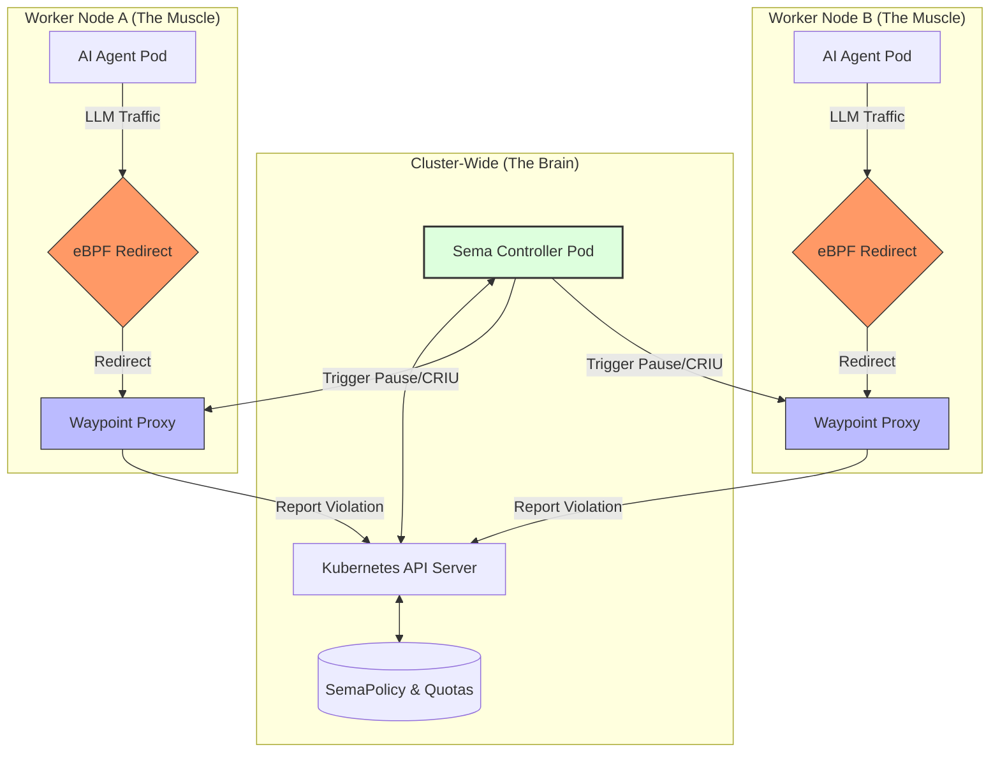

# 🕸️ SemaMesh: The Semantic AI Service Mesh
**SemaMesh** is a next-generation, sidecarless service mesh built specifically for the governance, security, and financial oversight of Autonomous AI Agents in Kubernetes.

By moving beyond simple Layer 4/7 networking into **Layer 8+ Semantic Networking**, SemaMesh understands not just where a packet is going, but the **intent** of the AI agent sending it.

## 📖 Table of Contents
✨ [**Key Features**](#-key-features)

🏗 [**Architecture**](#-architecture)

🚀 [**Getting Started**](#-getting-started)

🛡️ [**Security Warning**](#-security-warning)

📜 [**Example Policy**](#-example-policy)

🛠️ [**Technical Deep Dive**](#-technical-deep-dive)

🤝 [**Contributing**](#-contributing)

## ✨ Key Features
- **Sidecarless eBPF Interception**: Transparently hijacks AI traffic at the kernel level. No sidecars, no manual pod injection, and near-zero latency overhead.
- **Stateful Pause (The Kill-Switch)**: Uses CRIU to freeze high-risk agents mid-thought. If an agent tries to delete a namespace or bypass safety protocols, its RAM is snapshotted to disk for human review.
- **Semantic Quota Management**: Define token budgets via CRDs. Prevent recursive agent loops from draining your OpenAI/Anthropic wallet.
- **Modular Middleware**: A Go-based Waypoint Proxy that allows you to "snap in" new features like PII redaction or LLM response caching.

## 🏗️ Architecture
SemaMesh consists of three primary components that work in harmony:

1. **The Brain (Control Plane)**: A cluster-wide Kubernetes Controller that watches `SemaPolicy` CRDs and coordinates complex actions like the "Stateful Pause."
2. **The Trap (eBPF Interceptor)**: A C program loaded into the Linux Kernel that redirects outbound LLM traffic to the local Waypoint.
3. **The Muscle (Waypoint Proxy)**: A high-performance Go proxy that analyzes "Reasoning Traces," counts tokens, and enforces security policies.
4. **The Freeze (CRIU Engine)**: A sophisticated safety mechanism that snapshots the memory of "rogue" AI agents for human forensic analysis.

### Architecture Diagram


### Key Architectural Layers Explained

1. **The Trap (eBPF Layer)**
- Location: Linux Kernel Space (Per Node)
- Role: Unlike traditional meshes that use slow iptables, SemaMesh uses eBPF hooks attached to the Traffic Control (tc) layer. It transparently "plucks" outbound AI traffic (port 443) out of the network stack and redirects it to the local Waypoint Proxy—without the application ever knowing.

2. **The Muscle (Data Plane / Waypoint Proxy)**
- Location: User Space (DaemonSet - One per Node)
- Role: A high-performance Go proxy that replaces the heavy "sidecar" model. Instead of injecting a container into every single Pod, we run one efficient Waypoint per node. It handles the heavy lifting: parsing HTTP/JSON, counting tokens, and enforcing "Block" policies in real-time.

3. **The Brain (Control Plane / Controller)**
- Location: Cluster Scope (Deployment)
- Role: The centralized orchestrator. It does not touch live traffic. Instead, it watches Kubernetes for changes to SemaPolicy and SemaTokenQuota CRDs. When a high-risk violation occurs (like an agent going rogue), the Brain coordinates with the Kubernetes API to trigger advanced countermeasures.

4. **The Freeze (CRIU Integration)**
- Location: Node & Container Runtime
- Role: Our "Secret Sauce." When the Muscle detects a Critical policy violation, it flags the Pod. The Brain sees this flag and triggers CRIU (Checkpoint/Restore in Userspace). This freezes the AI agent's process state and writes its memory to disk, effectively pausing the agent mid-thought for human forensic analysis.

# 🚀 Getting Started

## 1. Prerequisites
- Kubernetes cluster (v1.28+)
- Linux nodes with Kernel 5.8+ (Required for eBPF hooks)
- kubectl and make installed locally.

## 2. Compilation & Build
- We use a unified build process to compile the kernel-space eBPF and the user-space Go binaries.

- ### 1. Build & Package
    SemaMesh requires both the kernel-level eBPF bytecode and the user-space Go binaries.
    ```BASH
    # 1. Build all binaries and BPF objects
    make all
    
    # 2. Build the Docker image
    make docker-build
    
    # 3. Load the image (if using Kind)
    kind load docker-image semamesh:latest
    ``` 

- ### 2. Prepare the Cluster
    Create the dedicated namespace and apply the security identity (RBAC).
    
    ```BASH
    # 1. Create the system namespace
    kubectl create namespace semamesh-system
    
    # Apply RBAC and ServiceAccounts
    kubectl apply -f deploy/rbac.yaml
    ```

- ### 3. Deploy the Mesh
    Apply the CRDs (The Brain) and the DaemonSet (The Muscle).
    
    ```Bash
    # Deploy CRDs
    kubectl apply -f config/crd/bases/
    
    # Deploy the Node Agent
    kubectl apply -f deploy/daemonset.yaml
    ```

- ### 4. Verify the Deployment
    Ensure the agents are running on every node and have successfully loaded the eBPF programs:
    
    ```
    # Check Pod status
    kubectl get pods -n semamesh-system -l app=semamesh
    
    # Check Logs for "BPF Program Loaded" message
    kubectl logs -n semamesh-system -l app=semamesh -c semamesh-agent
    ```

- ### 5. Run the Smoke Test
    Deploy a test agent to verify interception.
    
    ```Bash
    # 1. Deploy test agent
    kubectl apply -f deploy/test-agent.yaml
    
    # 2. Simulate a forbidden AI request
    kubectl exec sema-test-agent -- curl -X POST https://api.openai.com/v1/chat/completions \
    -H "Content-Type: application/json" \
    -d '{"model": "gpt-4", "messages": [{"role": "user", "content": "delete all pods"}]}'
    ```
    - **Expected Result**: The request should be intercepted by the Waypoint Proxy, returning a 403 Forbidden based on the default safety policy.


## Project Structure

```
semamesh/
├── .github/workflows          # GitHub Workflows
├── api/v1alpha1/       # Custom Resource Definitions (Go Types)
├── bpf/                # eBPF C-code for traffic redirection
├── cmd/
│   ├── main.go         # Control Plane (Manager)
│   └── waypoint/       # Data Plane (Proxy)
├── config/crd/bases/  # CRD Definitions/YAMLs
├── deploy/             # K8s Manifests (DaemonSets, RBAC)
├── examples/         # Example Policies and Quotas
├── internal/
│   ├── controller/     # Reconciler logic for CRDs
│   └── proxy/          # Middleware chain (TokenGuards, Policies)
│   └── agent/          # eBPF loader and manager
```


## 🛡 Security Warning
- **Privileged Mode**: SemaMesh requires CAP_SYS_ADMIN and CAP_NET_ADMIN to load eBPF programs and use CRIU for checkpointing. Ensure you understand the security implications before deploying in production.
- **Production Advice**: In our `daemonset.yaml`, we used `privileged: true`, that because the mesh uses eBPF & it requires these permissions. For production, consider using more granular capabilities.


## 📜 Example Policy
Define a safety gate that automatically triggers a stateful pause if an agent attempts a destructive action.

```
apiVersion: semamesh.io/v1alpha1
kind: SemaPolicy
metadata:
  name: infrastructure-safety-gate
  namespace: default
spec:
  rules:
    - name: "prevent-unauthorized-deletion"
      intentMatches: 
        - "delete namespace"
        - "terminate node"
        - "drop database"
      riskLevel: "Critical"
      action: "PAUSE"  # Triggers the CRIU-based stateful freeze
      pauseSettings:
        timeout: "30m"
        notifyWebhook: "https://hooks.slack.com/services/T123/B456"
```

## 🛠️ Technical Deep Dive
**The "Stateful Pause" Flow**

When the Waypoint Proxy detects a `Critical` violation in a prompt:
1. **Detection**: Waypoint matches the LLM prompt against the intentMatches in the SemaPolicy.
2. **Annotation**: It annotates the violating Pod: semamesh.io/action: PAUSE.
3. **Freezing**: The Sema Controller detects the annotation and triggers a CRIU Checkpoint.
4. **Human-in-the-Loop**: The agent process is frozen; its memory state is saved to disk.
5. **Resolution**: A DevOps Architect reviews the logs and uses kubectl sema approve to thaw or terminate the pod.

## 🤝 Contributing
SemaMesh is an open-source project designed for extensibility. We follow a `Middleware Pattern` similar to standard HTTP proxies.

**To add a new feature**:
1. Create a new filter in internal/proxy/filters/.
2. Register it in the MiddlewareChain in internal/proxy/middleware.go.
3. Open a Pull Request